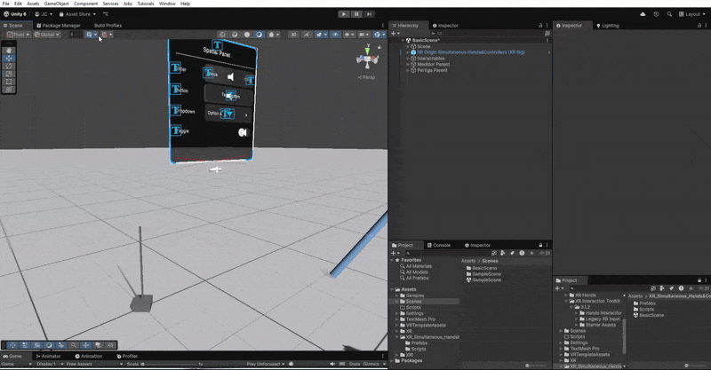

# XR_SimultaneousInput_Package

### [Descarga el unity Packcage Aquí](https://github.com/Adept-KeyCap/XR_SimultaneousInput_Package/releases/download/Release/XR_SimultaneousInput.rar)

- **Dependencies:**
  - OpenXR
  - Unity XR Interaction Toolkit
### XR Rig
Comopenetes que van incluidos dentro del XR Origin
- #### InyectXRRigDependenciesOnCall
  En este componente se asignarán ambos Rigs, ```Camera Offset (Simultaneous)``` y ```Camera Offset (Hands)```.
  
  Más adelante se llamarán 2 funciones de este Script, ```SetHandsOnlyRig``` y ```SetSimultaneoussRig```.
  
  
  
##
  
- #### XRInputModalitySimultaneous
  Este va a ser la pieza clave para hacer funcionar los controles y las manos de manera simultanea, primero debemos hacer las asignaciones correctas en el inspector.

  > ¡Importante tener en cuenta que los **Hand Interaction Visual** tienen que ir por fuera de cada mano!

  

  En la siguiente imagen vas a ver que las funciones que te comenté antes del **InyectXRRigDependenciesOnCall** se llaman dentro de eventos de Unity de la siguiente manera

  

  ##

- #### TrackingControllerStateEvents
   Este es solo un simple Script que detecta en que momento se pierde el tracking de cada control, en caso de que quieras añadir alguna lógica adicional de manera sencilla.
  
    

- #### FollowTargetOnCall
  El último script tiene que ver con los objetos que se asignan a cada control para que haga el segimiento. Este script creará un objeto vacío el cual se usará para almacenar la posición en donde se deben colocar los objetos a la hora que se pierda el _tracking_ de los controles
    - Primero hay que hacer la asignación del **XR Rig** dentro del objeto en si, se asigna la posición del control tanto a el **parentConstrain** como a este script de la siguiente manera.
  
    

> [!WARNING]
> ¡El Parent Constrain siempre debe empezar desactivado!

  - Segundo, hay que asignar la función **```MatchWorldTransform()```** en el script de **TrackingControllerStateEvents**, para poder reconocer en que momentos se sueltan o se agarran los objetos que tendrán el control pegado.
 
    
